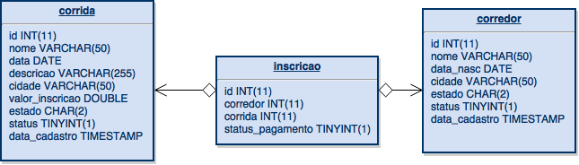

<html>
<head>
  <meta content="text/html; charset=windows-1252" http-equiv="content-type"><title></title>
  <meta name="generator">
</head>

<body style="direction: ltr;" lang="pt-BR" link="#0563c1">

<h1>Projeto SENAI RUNNER
</h1>

 

<h2>Modelo de dados</h2>

<h2>WS</h2>
<a href="http://54.94.187.233/senairunner/rest/">http://54.94.187.233/senairunner/rest</a>  

<h2>Acesso ao WS</h2>
<h3>Para consumir a lista de corridas cadastradas por exemplo, a URI do WS ficaria:</h3>
<a href="http://54.94.187.233/senairunner/rest/runs">http://54.94.187.233/senairunner/rest/runs</a> 

 

<h3>Exemplo de json retornado do /runs:</h3>

        [  
     &nbsp;&nbsp;{  
     &nbsp;&nbsp;&nbsp;&nbsp;"id":"1",
     &nbsp;&nbsp;&nbsp;&nbsp;"nome":"corrida1",
     &nbsp;&nbsp;&nbsp;&nbsp;"data":"2015-06-10",
     &nbsp;&nbsp;&nbsp;&nbsp;"descricao":"corrida1 descricao",
     &nbsp;&nbsp;&nbsp;&nbsp;"cidade":"sao jose",
     &nbsp;&nbsp;&nbsp;&nbsp;"valor_inscricao":"10",
     &nbsp;&nbsp;&nbsp;&nbsp;"estado":"SC",
     &nbsp;&nbsp;&nbsp;&nbsp;"status":"1",
     &nbsp;&nbsp;&nbsp;&nbsp;"data_cadastro":"2015-06-26 16:23:02"
     &nbsp;&nbsp;},
     &nbsp;&nbsp;{  
     &nbsp;&nbsp;&nbsp;&nbsp;"id":"2",
     &nbsp;&nbsp;&nbsp;&nbsp;"nome":"corrida2",
     &nbsp;&nbsp;&nbsp;&nbsp;"data":"2015-06-27",
     &nbsp;&nbsp;&nbsp;&nbsp;"descricao":"corrida 2 descricao",
     &nbsp;&nbsp;&nbsp;&nbsp;"cidade":"florianopolis",
     &nbsp;&nbsp;&nbsp;&nbsp;"valor_inscricao":"20",
     &nbsp;&nbsp;&nbsp;&nbsp;"estado":"SC",
     &nbsp;&nbsp;&nbsp;&nbsp;"status":"1",
     &nbsp;&nbsp;&nbsp;&nbsp;"data_cadastro":"2015-06-27 16:49:19"
     &nbsp;&nbsp;}   
     ]

  
<h3>Consumir uma corrida pelo id:</h3>
<a href="http://54.94.187.233/senairunner/rest/runs/1">http://54.94.187.233/senairunner/rest/runs/1</a>   

<h2>URI's</h2>
<table class="table" style="page-break-before: auto; page-break-after: auto; page-break-inside: auto; width: 100%;">

<tbody>   
<tr>
  <th>URI</th>
  <th>Tipo</th>
  <th>Descrição</th>
</tr>

<tr>
  <td>
    /runs
  </td>
  <td>
    GET
  </td>
  <td>
    Retorna a lista de corridas
  </td>  
</tr>

<tr>
  <td>
    /runs/{id}
  </td>
  <td>
    GET
  </td>
  <td>
    Retorna a corrida pelo id
  </td>  
</tr>

<tr>
  <td>
    /runs
  </td>
  <td>
    POST
  </td>
  <td>
    Insere uma corrida
  </td>  
</tr>

<tr>
  <td>
    /runs/{id}
  </td>
  <td>
    PUT
  </td>
  <td>
    Atualiza a corrida pelo id
  </td>  
</tr>

<tr>
  <td>
    /runs/{id}
  </td>
  <td>
    DELETE
  </td>
  <td>
    Excluir a corrida pelo id
  </td>  
</tr>

<tr>
  <td>
    /runners
  </td>
  <td>
    GET
  </td>
  <td>
    Retorna a lista de corredores
  </td>  
</tr>

<tr>
  <td>
    /runners/{id}
  </td>
  <td>
    GET
  </td>
  <td>
    Retorna o corredor pelo id
  </td>  
</tr>

<tr>
  <td>
    /runners
  </td>
  <td>
    POST
  </td>
  <td>
    Insere um corredor
  </td>  
</tr>

<tr>
  <td>
    /runners/{id}
  </td>
  <td>
    PUT
  </td>
  <td>
    Atualiza o corredor pelo id
  </td>  
</tr>

<tr>
  <td>
    /runners/{id}
  </td>
  <td>
    DELETE
  </td>
  <td>
    Excluir o corredor pelo id
  </td>  
</tr>

<tr>
  <td>
    /runsEntry
  </td>
  <td>
    GET
  </td>
  <td>
    Retorna a lista de inscrições
  </td>  
</tr>

<tr>
  <td>
    /runsEntry/{id}
  </td>
  <td>
    GET
  </td>
  <td>
    Retorna a inscrição pelo id
  </td>  
</tr>

<tr>
  <td>
    /runsEntry
  </td>
  <td>
    POST
  </td>
  <td>
    Insere uma inscrição
  </td>  
</tr>

<tr>
  <td>
    /runsEntry/{id}
  </td>
  <td>
    PUT
  </td>
  <td>
    Atualiza a inscrição pelo id
  </td>
</tr>

<tr>
  <td>
    /runsEntry/{id}
  </td>
  <td>
    DELETE
  </td>
  <td>
    Excluir a inscrição pelo id
  </td>  
</tr>

<tr>
  <td>
    /runs/{id}/runners
  </td>
  <td>
    GET
  </td>
  <td>
    Retorna a lista de corredores inscritos em uma corrida
  </td>  
</tr>

<tr>
  <td>
    /runners/{id}/runs
  </td>
  <td>
    GET
  </td>
  <td>
    Retorna a lista de corridas que um corredor está inscrito 
  </td>  
</tr>

</tbody>
</table>

</html>
